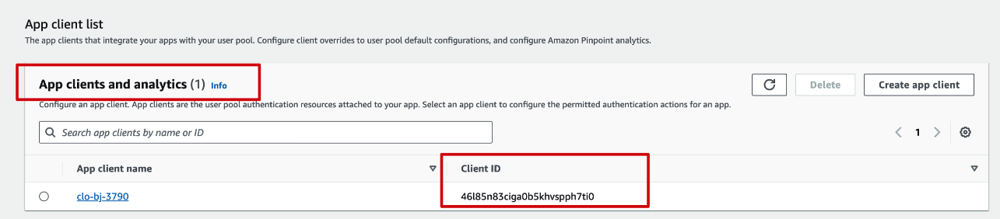
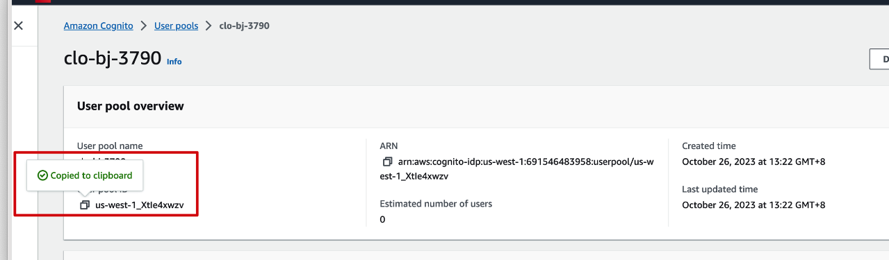
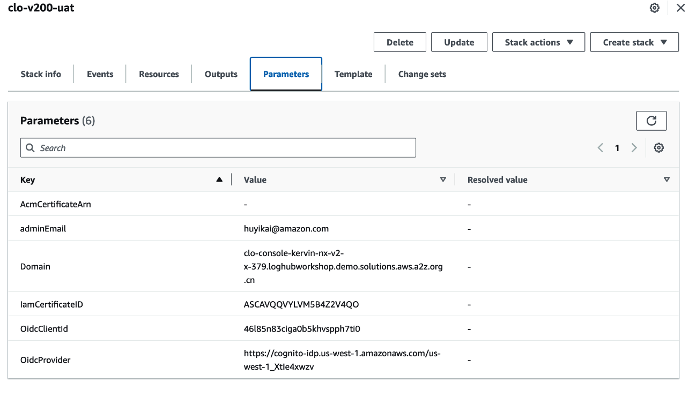

# Use Cross Region Cognito as OIDC

Create a cognito in Standard AWS Region.


After the cognito is created, launch the cloudformation.

### Get the OidcClientID
The OidcClientID is the App client ID



### Get the OidcProvider
```
https://cognito-idp.${REGION}.amazonaws.com/${USER_POOL_ID}
```



### CloudFormation parameters example

