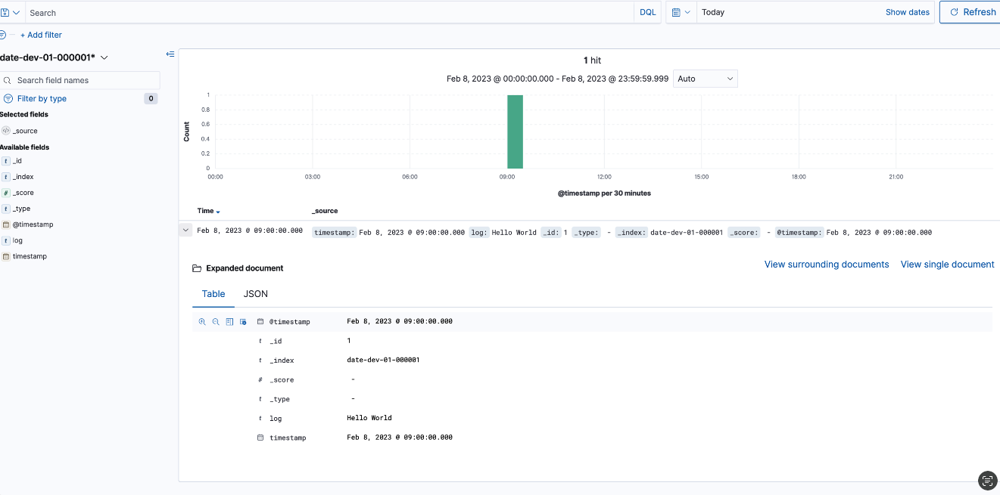

# OpenSearch Cheat Sheet

### 查看index

```
GET s3-dev-1026-04-s3-2021.10.26/_mapping
```

### 查看index_template
```
GET /_index_template/
GET /_index_template/cloudfront-dev-1206-cloudfront-template
```

### 查看当前shard数以及存储大小
```
GET /_cat/indices?v

GET _cat/shards?v=true&h=index,prirep,shard,store&s=prirep,store&bytes=gb
```

### 删除index的data
```

DELETE /s3-dev-1026-04-s3-2021.10.26
```

### 创建/更新index_template

```

PUT _index_template/nginx-dev-04-template
{
    "index_patterns": [
        "nginx-dev-04*"
    ],
    "template": {
        "aliases": {},
        "settings": {
            "number_of_shards": 5,
            "number_of_replicas": 1
        },
        "mappings": {
            "properties": {
                "path": {
                    "type": "text",
                    "fields": {
                        "keyword": {
                            "ignore_above": 256,
                            "type": "keyword"
                        }
                    }
                },
                "referrer": {
                    "type": "text",
                    "fields": {
                        "keyword": {
                            "ignore_above": 256,
                            "type": "keyword"
                        }
                    }
                },
                "agent": {
                    "type": "text",
                    "fields": {
                        "keyword": {
                            "ignore_above": 256,
                            "type": "keyword"
                        }
                    }
                },
                "@timestamp": {
                    "path": "timestamp",
                    "type": "alias"
                },
                "code": {
                    "type": "keyword"
                },
                "method": {
                    "type": "keyword"
                },
                "size": {
                    "type": "long"
                },
                "file_name": {
                    "type": "text"
                },
                "host": {
                    "type": "text"
                },
                "remote": {
                    "type": "ip"
                },
                "user": {
                    "type": "text"
                },
                "timestamp": {
                    "type": "date"
                }
            }
        }
    }
}
```


### 插入一条假数据
```

PUT awswaf-waf-2023-01-06/_doc/1
{
  "timestamp": 1672985361778,
    "formatVersion": 1,
    "webaclId": "arn:aws:wafv2:ap-northeast-1:012345678901:regional/webacl/plat-sg03-security-testing-waf-webacl001-alb-tokyo/ee836909-cd2e-4823-a0da-7f4b42f8853d",
    "terminatingRuleId": "Default_Action",
    "terminatingRuleType": "REGULAR",
    "action": "ALLOW",
    "terminatingRuleMatchDetails": [],
    "httpSourceName": "ALB",
    "httpSourceId": "012345678901-app/plat-testing-pub-gateway-alb/d9c4eefd4de07408",
    "ruleGroupList": [
      {
        "ruleGroupId": "AWS#AWSManagedRulesAmazonIpReputationList",
        "terminatingRule": null,
        "nonTerminatingMatchingRules": [
          {
            "ruleId": "AWSManagedReconnaissanceList",
            "action": "COUNT",
            "overriddenAction": "BLOCK",
            "ruleMatchDetails": []
          }
        ],
        "excludedRules": null,
        "customerConfig": null
      },
      {
        "ruleGroupId": "AWS#AWSManagedRulesKnownBadInputsRuleSet",
        "terminatingRule": null,
        "nonTerminatingMatchingRules": [],
        "excludedRules": null,
        "customerConfig": null
      },
      {
        "ruleGroupId": "AWS#AWSManagedRulesSQLiRuleSet",
        "terminatingRule": null,
        "nonTerminatingMatchingRules": [],
        "excludedRules": null,
        "customerConfig": null
      },
      {
        "ruleGroupId": "AWS#AWSManagedRulesLinuxRuleSet",
        "terminatingRule": null,
        "nonTerminatingMatchingRules": [],
        "excludedRules": null,
        "customerConfig": null
      },
      {
        "ruleGroupId": "AWS#AWSManagedRulesCommonRuleSet",
        "terminatingRule": null,
        "nonTerminatingMatchingRules": [],
        "excludedRules": null,
        "customerConfig": null
      }
    ],
    "rateBasedRuleList": [
      {
        "rateBasedRuleId": "arn:aws:wafv2:ap-northeast-1:012345678901_MANAGED:regional/ipset/ee836909-cd2e-4823-a0da-7f4b42f8853d_a46ef68c-075e-444d-a5c6-ca76cc2af04d_IPV4/a46ef68c-075e-444d-a5c6-ca76cc2af04d",
        "rateBasedRuleName": "Rate-based-rule",
        "limitKey": "IP",
        "maxRateAllowed": 100,
        "limitValue": "135.125.217.54"
      }
    ],
    "nonTerminatingMatchingRules": [],
    "requestHeadersInserted": null,
    "responseCodeSent": null,
    "httpRequest": {
      "clientIp": "135.125.217.54",
      "country": "FR",
      "headers": [
        {
          "name": "Host",
          "value": "18.182.93.230"
        },
        {
          "name": "Content-Length",
          "value": "20"
        },
        {
          "name": "Accept-Encoding",
          "value": "gzip, deflate"
        },
        {
          "name": "Accept",
          "value": "*/*"
        },
        {
          "name": "User-agent",
          "value": "Mozilla/5.0 (X11; Linux x86_64) AppleWebKit/537.36 (KHTML, like Gecko) Chrome/81.0.4044.129 Safari/537.36"
        },
        {
          "name": "Connection",
          "value": "keep-alive"
        },
        {
          "name": "Content-Type",
          "value": "application/x-www-form-urlencoded"
        }
      ],
      "uri": "/",
      "args": "",
      "httpVersion": "HTTP/1.1",
      "httpMethod": "POST",
      "requestId": "1-63b7bb11-13ba7c6317c83ba529ec1a5b"
    },
    "labels": [
      {
        "name": "awswaf:managed:aws:amazon-ip-list:AWSManagedReconnaissanceList"
      }
    ],
    "webaclName": "plat-sg03-security-testing-waf-webacl001-alb-tokyo",
    "host": "18.182.93.230",
    "userAgent": "Mozilla/5.0 (X11; Linux x86_64) AppleWebKit/537.36 (KHTML, like Gecko) Chrome/81.0.4044.129 Safari/537.36"
  
}
```


### 如何写Query 语句
https://www.elastic.co/guide/en/kibana/master/kuery-query.html#:~:text=The%20Kibana%20Query%20Language%20(KQL,and%20operators%20as%20you%20type.

### 查看Fluent-bit的数据发送情况
```

curl -s http://127.0.0.1:2022/api/v1/metrics | jq
```


### 如何查看Index里面的数据
```

GET /my-index-000001/_search
```


### 如何搜索Index里面的数据

下面为完全匹配

```

GET /syslog-s3-1680539104195029-auto-2023-04-03-000001/_search
{
  “query”: {
    “match_phrase”: {
      “message”: “test-Logging-syslog-nlb-9f205e83bfc8557c.elb.ap-northeast-1.amazonaws.com-TCP-RFC3164"
    }
  }
}
```

### 如何查看fluent-bit无法启动的问题
```

/opt/fluent-bit/bin/fluent-bit -c /opt/fluent-bit/etc/fluent-bit.conf
```

### 当需要修改index 的shards的时候，需要先关闭索引
```

POST /my_index/_close

POST /my_index/_open
```

### 查看端口占用
```

netstat -ntulp | grep 3306
```


### 如何测试日期格式

先创建Index Template
请按需选择替换下面的日期格式
```

"format": "MMM d, yyyy h:mm:ss a||yyyy-MM-dd'T'HH:mm:ss||dd/MMM/yyyy:HH:mm:ss Z||epoch_millis"
```
```

PUT _index_template/date-dev-01-template
{
    "index_patterns": [
        "date-dev-01*"
    ],
    "template": {
        "aliases": {},
        "settings": {
            "number_of_shards": 1,
            "number_of_replicas": 0
        },
        "mappings": {
            "properties": {
                "@timestamp": {
                    "path": "timestamp",
                    "type": "alias"
                },
                "timestamp": {
                    "type": "date",
                    "format": "yyyy-MM-dd HH:mm:ss SSS"
                }
            }
        }
    }
}
```

然后插入一条测试数据，在AOS Discover里面看能否解析
```

PUT date-dev-01-000001/_doc/1
{
  "timestamp": "2023-02-08 09:00:00 +0800",
  "log": "Hello World"
}
```

```

PUT %3Cleitest-vpcflow-%7Bnow%7Byyyy-MM-dd%7D%7D-000001%3E
{
  "aliases": {
    "leitest-vpcflow": {
      "is_write_index": true
    }
} }

```
