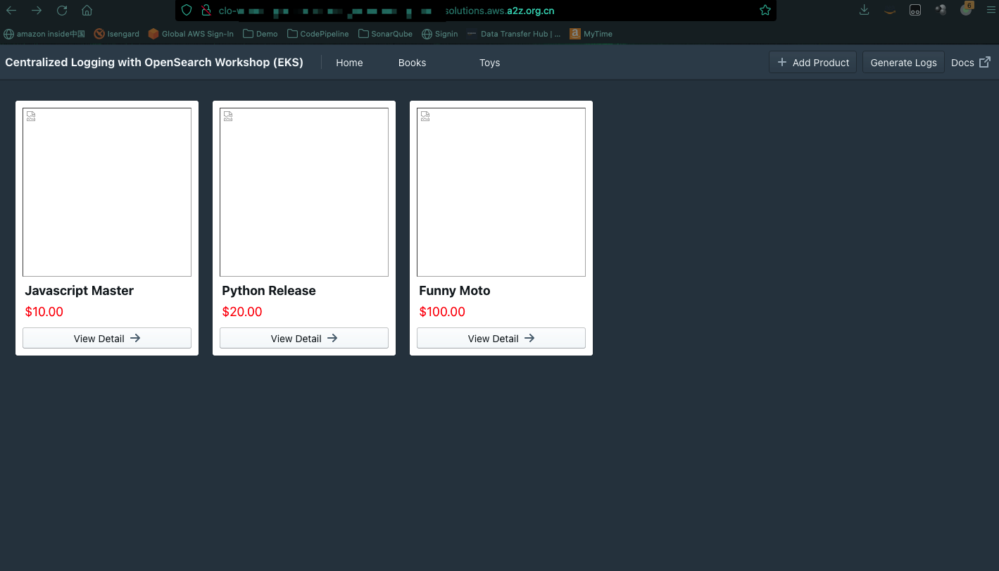
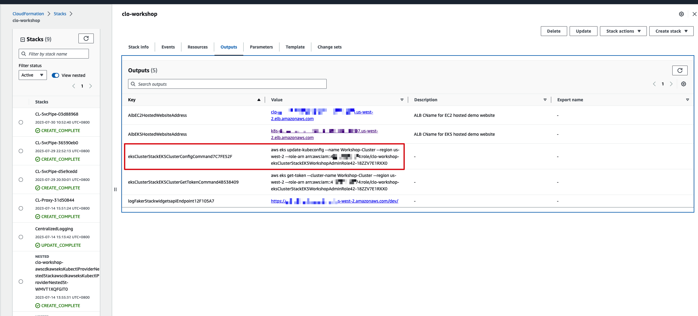
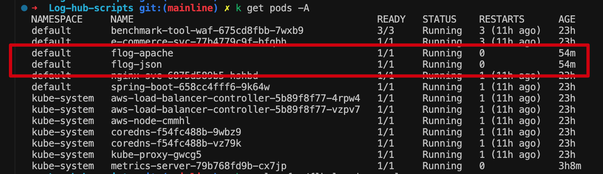

# Centralized Logging with OpenSearch Workshop CN version

> **Note**
> 
> If you are going to test EKS log in Global region, just use this link to create the CloudFormation stack: `https://aws-gcr-solutions.s3.amazonaws.com/log-hub-workshop/latest/CLWorkshopEC2AndEKS.template`.


Click the template link, and download the template.

- [CloudFormation template for cn-north-1](https://github.com/YikaiHu/aws-is-how/blob/main/tools/clo-workshop-cn/CLWorkshopEC2AndEKS-cn-north-1.template)
- [CloudFormation template for cn-northwest-1](https://github.com/YikaiHu/aws-is-how/blob/main/tools/clo-workshop-cn/CLWorkshopEC2AndEKS-cn-northwest-1.template)

Go to CloudFormation Console and deploy the stack by upload the template yaml.

You can visit the e-commerce website through the alb link in CloudFormation Output.

> **Note**
> 
> If you are unable to access this interface, please ensure that your AWS China account has completed the ICP whitelist filing and has opened ports 80 and 443.
> 
> Please refer to this [guide](http://cet-bucket.s3.cn-north-1.amazonaws.com.cn/Process/ICP%20Exception%20Request/BMS%20ICP%20Exception%20Request%20%E6%93%8D%E4%BD%9C%E8%AF%B4%E6%98%8E.pdf).



## How to crete application log in workshop EKS cluster - DaemonSet

1. 在本地 Vscode 中关联 EKS, 你可以在 Workshop CloudFormation Stack 的 Output, 例子如下

  ```shell
  aws eks update-kubeconfig --name Workshop-Cluster --region us-west-2 --role-arn arn:aws:iam::0123456789012:role/clo-workshop-eksClusterStackEKSWorkshopAdminRole42-18ZZV7E1RXX0
  ```
  
2. 下载 [clo-eks-uat.yaml](./clo-eks-uat.yaml)
3. 执行`kubectl apply -f clo-eks-uat.yaml`, 你可以看到如下的pods


其中json 日志还有 apache 日志来自于flog，其余的复用workshop的电商网站里面的pod.

* [Nginx Log](#nginx-log)
* [Apache Log](#apache-log)
* [Json Log](#json-log)
* [Single-line Log](#single-line-log)
* [Spring-boot Log](#spring-boot-log)

### Nginx Log
- Log format:
  ```
  log_format  main  '$remote_addr - $remote_user [$time_local] "$request" '
  '$status $body_bytes_sent "$http_referer" '
  '"$http_user_agent" "$http_x_forwarded_for"';
  ```

- Sample log:
  ```
  127.0.0.1 - - [24/Dec/2021:01:27:11 +0000] "GET / HTTP/1.1" 200 3520 "-" "curl/7.79.1" "-"
  ```

- Log path: 
  ```
  /var/log/containers/nginx-svc*
  ```

### Apache Log
- Log format:
  ```
  LogFormat "%h %l %u %t \"%r\" %>s %b" combined
  ```

- Sample log:
  ```
  55.146.151.251 - - [24/Jul/2022:07:59:59 +0000] "POST /e-enable HTTP/1.1" 405 13357
  ```

- Log path: 
  ```
  /var/log/containers/flog-apache*.log
  ```

### Json Log

- Sample log:
  ```
    {"host":"176.54.164.169", "user-identifier":"kling1353", "time":"24/Jul/2022:07:56:40 +0000", "method": "PUT", "request": "/unleash/magnetic/matrix", "protocol":"HTTP/1.1", "status":403, "bytes":29229, "referer": "http://www.chiefleading-edge.info/frictionless"}
  ```
- Log time format:
  ```
  %d/%b/%Y:%H:%M:%S %z
  ```
- Log path: 
  ```
  /var/log/containers/flog-json*.log
  ```

### Single-line Log
- Regex:
  ```
  (?<remote_addr>[0-9.-]+)\s+(?<remote_ident>[\w.-]+)\s+(?<remote_user>[\w.-]+)\s+\[(?<time_local>[^\[\]]+|-)\]\s+\"(?<request_method>(?:[^"]|\")+)\s(?<request_uri>(?:[^"]|\")+)\s(?<request_protocol>(?:[^"]|\")+)\"\s+(?<status>\d{3}|-)\s+(?<response_size_bytes>\d+|-).*
  ```

- Sample log:
  ```
  55.146.151.251 - - [24/Jul/2022:07:59:59 +0000] "POST /e-enable HTTP/1.1" 405 13357
  ```
- Log time format:
  ```
  %d/%b/%Y:%H:%M:%S %z
  ```
- Log path: 
  ```
  /var/log/containers/flog-apache*.log
  ```

### Spring-boot Log
- Log format:
  ```
  %d{yyyy-MM-dd HH:mm:ss} %-5level [%thread] %logger : %msg%n
  ```

- Sample log:
  ```
  2022-02-18 10:32:26 ERROR [http-nio-8080-exec-1] org.apache.catalina.core.ContainerBase.[Tomcat].[localhost].[/].[dispatcherServlet] : Servlet.service() for servlet [dispatcherServlet] in context with path [] threw exception [Request processing failed; nested exception is java.lang.ArithmeticException: / by zero] with root cause
  java.lang.ArithmeticException: / by zero
    at com.springexamples.demo.web.LoggerController.logs(LoggerController.java:22)
    at java.base/jdk.internal.reflect.NativeMethodAccessorImpl.invoke0(Native Method)
    at java.base/jdk.internal.reflect.NativeMethodAccessorImpl.invoke
  ```

- Log path: 
  ```
  /var/log/containers/spring-boot*
  ```

## How to crete application log in workshop EKS cluster - Sidecar

> **Note**
> 注意，如果使用的是Workshop 创建的EKS，需要把 CLO 生成的FLB的config 的cpu 改成`100m`

需要拼接一下不同Log Generator Container 和CLO生成的sidecar sh，

Example:

```yaml
---
apiVersion: v1
kind: Namespace
metadata:
  name: logging

---
apiVersion: v1
kind: ServiceAccount
metadata:
  name: fluent-bit
  namespace: logging
  annotations:
    eks.amazonaws.com/role-arn: arn:aws:iam::428529255974:role/CL-EKS-LogAgent-Role-e009f502

  ........
  ........
  ........

    [PARSER]
        Name fluentbit_prom_metrics_to_json
        Format regex
        Regex ^(?<metric>[^ {}]*){name=\"(?<plugin>[^ {}\"]*)\"} (?<value>[^ ]*) (?<time>[^ ]*)

---
apiVersion: v1
kind: Pod
metadata:
  namespace: logging
  name: app-sidecar
  labels:
    app: app-sidecar
spec:
  containers:
    - name: flog-json-amd64
      image: nginx:1.20
      imagePullPolicy: Always
      ports:
        - containerPort: 80
          protocol: TCP
      resources:
        limits:
          memory: 100Mi
        requests:
          cpu: 25m
          memory: 100Mi
      args:
        - /bin/bash
        - -xec
        - |
          curl -LS "https://kervin-solutions.s3.cn-north-1.amazonaws.com.cn/flog_0.6.0-20220826_linux_amd64.tar.gz" -o /tmp/flog.tar.gz
          cd /tmp
          tar -xvzf flog.tar.gz
          mv flog /usr/bin
          /usr/bin/flog -d 1s -l -f json | sed -e 's/datetime/time/g' | tee /var/log/flog/flog.log
      volumeMounts:
        - name: app-log
          mountPath: /var/log/flog
    # Fluent-bit's container
    - name: fluent-bit
      image: public.ecr.aws/aws-observability/aws-for-fluent-bit:2.31.12
      imagePullPolicy: Always
      env:
        - name: CLUSTER_NAME
          value: "Workshop-Cluster"
      ports:

      .......
      .......
      .......

  serviceAccountName: fluent-bit
  
```

* [Nginx Log](#nginx-log-sidecar)
* [Apache Log](#apache-log-sidecar)
* [Json Log](#json-log-sidecar)
* [Single-line Log](#single-line-log-sidecar)
* [Spring-boot Log](#spring-boot-log-sidecar)

### Nginx Log Sidecar
注意，该模式下生成的 Log 和 Workshop生成的log不一样，所以需要单独创建一个Sidecar的config
- Log format:
  ```
  log_format  main  '$remote_addr - $remote_user [$time_local] "$request" '
  '$status $body_bytes_sent';
  ```

- Sample log:
  ```
  240.20.85.168 - - [22/Jul/2023:07:09:16 +0000] "POST /metrics/strategize/deliverables/reinvent HTTP/2.0" 200 18498
  ```

- Log path: 
  ```
  /var/log/nginx/access.log
  ```
- Container yaml:
  注意切换对应的操作系统, 如果你的EKS 由Workshop启动，则选择amd64

  把下面的代码，copy到`containers:`下面
  ```yaml
    - name: nginx
      image: nginx:1.20
      ports:
        - containerPort: 80
          protocol: TCP
      resources:
        limits:
          memory: 100Mi
        requests:
          cpu: 25m
          memory: 100Mi
      args:
        - /bin/bash
        - -xec
        - |
          curl -LS "https://kervin-solutions.s3.cn-north-1.amazonaws.com.cn/flog_0.6.0-20220826_linux_amd64.tar.gz" -o /tmp/flog.tar.gz
          cd /tmp
          tar -xvzf flog.tar.gz
          mv flog /usr/bin
          /usr/bin/flog -d 2s -l | tee /var/log/nginx/access.log
      volumeMounts:
        - name: app-log
          mountPath: /var/log/nginx
  ```

### Apache Log Sidecar
- Log format:
  ```
  LogFormat "%h %l %u %t \"%r\" %>s %b" combined
  ```

- Sample log:
  ```
  55.146.151.251 - - [24/Jul/2022:07:59:59 +0000] "POST /e-enable HTTP/1.1" 405 13357
  ```

- Log path: 
  ```
  /var/log/apache/log.log
  ```
- Container yaml:
  注意切换对应的操作系统, 如果你的EKS 由Workshop启动，则选择amd64

  把下面的代码，copy到`containers:`下面
  ```yaml
    - name: flog-apache
      image: nginx:1.20
      resources:
        limits:
          cpu: 25m
          memory: 128Mi
      env:
        - name: FLOG_VERSION
          value: 0.6.0-20220826
        - name: GITHUB_HOST
          value: github.com
      args:
        - /bin/bash
        - -xec
        - |
          curl -fsSL https://kervin-solutions.s3.cn-north-1.amazonaws.com.cn/get-flog.sh | bash
          mkdir -p /var/log/apache/
          /usr/bin/flog -d 2s -f apache_common -l | tee /var/log/apache/log.log
      volumeMounts:
        - name: app-log
          mountPath: /var/log/apache
  ```

### Json Log Sidecar

- Sample log:
  ```
    {"host":"176.54.164.169", "user-identifier":"kling1353", "time":"24/Jul/2022:07:56:40 +0000", "method": "PUT", "request": "/unleash/magnetic/matrix", "protocol":"HTTP/1.1", "status":403, "bytes":29229, "referer": "http://www.chiefleading-edge.info/frictionless"}
  ```
- Log time format:
  ```
  %d/%b/%Y:%H:%M:%S %z
  ```
- Log path: 
  ```
  /var/log/flog/flog.log
  ```

- Container yaml:
  注意切换对应的操作系统, 如果你的EKS 由Workshop启动，则选择amd64

  把下面的代码，copy到`containers:`下面
  ```yaml
    - name: flog-json-amd64
      image: nginx:1.20
      imagePullPolicy: Always
      ports:
        - containerPort: 80
          protocol: TCP
      resources:
        limits:
          memory: 100Mi
        requests:
          cpu: 25m
          memory: 100Mi
      args:
        - /bin/bash
        - -xec
        - |
          curl -LS "https://kervin-solutions.s3.cn-north-1.amazonaws.com.cn/flog_0.6.0-20220826_linux_amd64.tar.gz" -o /tmp/flog.tar.gz
          cd /tmp
          tar -xvzf flog.tar.gz
          mv flog /usr/bin
          /usr/bin/flog -d 1s -l -f json | sed -e 's/datetime/time/g' | tee /var/log/flog/flog.log
      volumeMounts:
        - name: app-log
          mountPath: /var/log/flog
  ```

### Single-line Log Sidecar
我们复用Apache 的log 作为单行日志

- Regex:
  ```
  (?<remote_addr>[0-9.-]+)\s+(?<remote_ident>[\w.-]+)\s+(?<remote_user>[\w.-]+)\s+\[(?<time_local>[^\[\]]+|-)\]\s+\"(?<request_method>(?:[^"]|\")+)\s(?<request_uri>(?:[^"]|\")+)\s(?<request_protocol>(?:[^"]|\")+)\"\s+(?<status>\d{3}|-)\s+(?<response_size_bytes>\d+|-).*
  ```

- Sample log:
  ```
  55.146.151.251 - - [24/Jul/2022:07:59:59 +0000] "POST /e-enable HTTP/1.1" 405 13357
  ```
- Log time format:
  ```
  %d/%b/%Y:%H:%M:%S %z
  ```
- Log path: 
  ```
  /var/log/apache/log.log
  ```
- Container yaml:
  注意切换对应的操作系统, 如果你的EKS 由Workshop启动，则选择amd64

  把下面的代码，copy到`containers:`下面
  ```yaml
    - name: flog-apache
      image: nginx:1.20
      resources:
        limits:
          cpu: 25m
          memory: 128Mi
      env:
        - name: FLOG_VERSION
          value: 0.6.0-20220826
        - name: GITHUB_HOST
          value: github.com
      args:
        - /bin/bash
        - -xec
        - |
          curl -fsSL https://kervin-solutions.s3.cn-north-1.amazonaws.com.cn/get-flog.sh | bash
          mkdir -p /var/log/apache/
          /usr/bin/flog -d 2s -f apache_common -l | tee /var/log/apache/log.log
      volumeMounts:
        - name: app-log
          mountPath: /var/log/apache
  ```

### Spring-boot Log Sidecar
- Log format:
  ```
  %d{yyyy-MM-dd HH:mm:ss} %-5level [%thread] %logger : %msg%n
  ```

- Sample log:
  ```
  2022-02-18 10:32:26 ERROR [http-nio-8080-exec-1] org.apache.catalina.core.ContainerBase.[Tomcat].[localhost].[/].[dispatcherServlet] : Servlet.service() for servlet [dispatcherServlet] in context with path [] threw exception [Request processing failed; nested exception is java.lang.ArithmeticException: / by zero] with root cause
  java.lang.ArithmeticException: / by zero
    at com.springexamples.demo.web.LoggerController.logs(LoggerController.java:22)
    at java.base/jdk.internal.reflect.NativeMethodAccessorImpl.invoke0(Native Method)
    at java.base/jdk.internal.reflect.NativeMethodAccessorImpl.invoke
  ```

- Log path: 
  ```
  /var/log/spring-boot/access.log
  ```
- Container yaml:
  注意切换对应的操作系统, 如果你的EKS 由Workshop启动，则选择amd64

  把下面的代码，copy到`containers:`下面
  ```yaml
    - name: spring-boot
      image: openjdk:11-jre
      resources:
        limits:
          cpu: 25m
          memory: 512Mi
      args:
        - /bin/bash
        - -xec
        - |
          cd /tmp
          wget https://aws-gcr-solutions.s3.amazonaws.com/log-hub-workshop/v1.0.0/petstore-0.0.1-SNAPSHOT.jar
          mkdir -p /var/log/spring-boot/
          java -jar petstore-0.0.1-SNAPSHOT.jar --server.port=80 | tee /var/log/spring-boot/access.log
      ports:
        - containerPort: 80
          protocol: TCP
      volumeMounts:
        - name: app-log
          mountPath: /var/log/spring-boot
  ```

  然后你需要手动进入spring-boot 这个pod `kubectl exec -it pod/app-sidecar -n logging -c spring-boot bash`,
  
  执行一下 `curl http://localhost/hello`